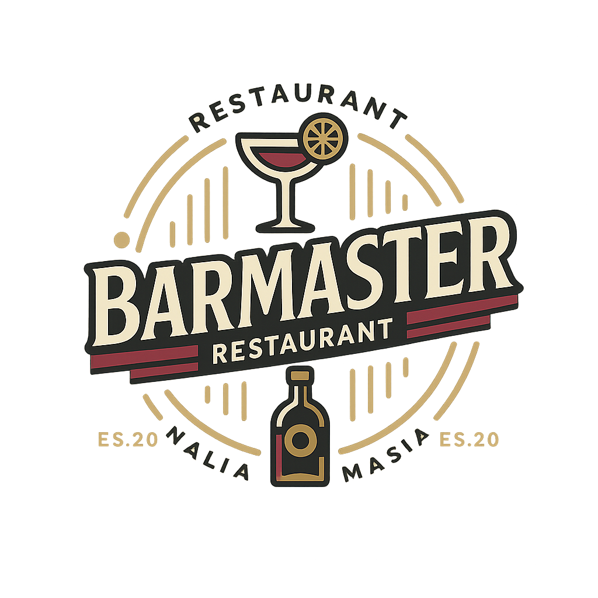

<div align="center">
  
</div>

<div align="center">
<h1>🍽️ Barmaster 🍽️ <br> 
Sistema de administracion de establecimiento gastronomico</h1>

</div>


# Descripcion General
## Sobre este Proyecto

El sistema opera como una plataforma centralizada para la gestión integral de establecimientos gastronómicos que combina base de datos PostgreSQL, que almacena la información de los mozos y de cada pedido y transacción que se produce, una interfaz web multiusuarios y una arquitectura cliente-servidor con API REST y comunicacion bidireccional de mensajeria mediante sockets usando SignalR.   


## Tecnologias Utilizadas
Este proyecto full-stack utiliza las siguientes tecnologias y librerias

BACKEND

* ASP.NET

* Entity Framework Core
 
* SignalR - Server
 
* JWT 
 
* QuestPDF
 
  
FRONT-ENDS

  * Node.JS
  
    * Frontend - Clientes
    
      * React.JS    
      
      * Vite
      
      * Material UI
      
      * SignalR - Client
      
      * Axios
      
      * React-Router
      
      * Dotenv
      
    * Frontend - Administracion
    
      * React.JS    
      
      * Vite
      
      * Material UI
      
      * SignalR - Client
      
      * Axios
      
      * React-Router
      
      * Dotenv
      
      * Redux
      
      * PDFMake

DATABASE

* PostgreSQL

CONTROL DE VERSIONES

* GIT

* BittBucket
 
# Instalacion

La instalacion de este proyecto necesita de una serie de pasos, listados a continuacion:


1. Instalacion de software necesario
2. Clonar el repositorio del proyecto
3. Crear bases de datos necesarias
4. Crear archivos de configuracion de BackendApi
5. Crear archivos .env
6. Instalar dependencias de Node.JS
7. Importar estructuras de las bases de datos usando EF Core
   

### 1. Instalacion de software necesario


Para la instalacion de este proyecto se necesita la instalacion previa de los siguientes programas:

__PostgreSQL__ 
<a href="https://www.postgresql.org/download/">Descarga</a>

__Node.JS__
<a href="https://nodejs.org/es">Descarga</a>

__.NET__
<a href="https://dotnet.microsoft.com/es-es/">Descarga</a>

__GIT__
<a href="https://git-scm.com/">Descarga</a>

__RECOMENDADO: VISUAL STUDIO COMMUNITY 2022__
<a href="https://visualstudio.microsoft.com/es/downloads/">Descarga</a>


Una vez que cuente son estos programas instalados y funcionando, podemos proceder con el proceso de instalacion.

### 2. Clonar el repositorio del proyecto

Una vez instalados estos programas, se procede a clonar este repositorio en el directorio deseado:

`
git clone https://bitbucket.org/EstebanSaborido/2024-grupo6.git
`

Se creará una copia del proyecto en el directorio indicado, el cual contiene todos los archivos encontrados en el repositorio de BitBucket.


### 3. Crear bases de datos necesarias

Se utilizarán dos bases de datos distintas para el uso de este software: una para entornos de Desarrollo y una para entorno de Producción.

Esta distinción permite realizar tareas de desarrollo ,pruebas y correcciones sin comprometer informacion importante de la base de datos de produccion

Para ello crearemos dos bases de datos vacias en PostgreSQL, haciendo distincion de cual pertenece a cada entorno, Por ejemplo: `BarDB` y `BarDBProd`

La estructura será creada automaticamente en un paso siguiente.

### 4. Crear archivos de configuracion de BackendApi
En el directorio de la aplicacion servidor, llamado `/BackEndAPI`, se encuentra un archivo de configuracion de variables de entorno, de nombre `/appsettings.json`, cuyo contenido es el siguiente:

```
{
  "Logging": {
    "LogLevel": {
      "Default": "Information",
      "Microsoft.AspNetCore": "Warning"
    }
  },
  "AllowedHosts": "*",
  "JWT": {
    "Issuer": "BackendAPI",
    "Audience": "FrontendCliente",
    "SigningKey": "{SuLlaveAqui}"
  },
  "ConnectionStrings": {
    "WebApiDatabase": "Host=localhost; Database={NombreDeDB}; Username={SuUsuario}; Password={SuContraseña}"
  }
}
```
Se debe llenar la información faltante entre las `{llaves}`.

Podemos generar una `SigningKey` aleatoria en la web, por ejemplo en <a href="https://jwtsecret.com/generate">este vinculo</a>, y proceder a completar el archivo `appsettings.json`

En WebApiDatabase, es necesario completar la informacion con las credenciales utilizadas en PostgreSQL, y utilizar el nombre de la base de datos que se quiera usar para el entorno que se está creando

Un ejemplo del codigo terminado seria el siguiente:
 
```
{
  "Logging": {
    "LogLevel": {
      "Default": "Information",
      "Microsoft.AspNetCore": "Warning"
    }
  },
  "AllowedHosts": "*",
  "JWT": {
    "Issuer": "BackendAPI",
    "Audience": "FrontendCliente",
    "SigningKey": "7ca3f147cfde2aad1c765d32db5529ea8a7d0c6960d18d603ef0fc20155dc7
    2fee679280fd7c2089a63f5d0e944e15dab8fe3b7fb0e0a6a971dd4630583fee850b782650bc3
    d8d1eb214b0f638d9fa1c0b7917bdc1270a4dfc1a2b7bc805a2832429a5cbc0dd5d069bf4563afa7ba1f0f65f88a7351e139a17e168b37408a4a5"
  },
  "ConnectionStrings": {
    "WebApiDatabase": "Host=localhost; Database=BarDB; Username=admin; Password=123456"
  }
}
```

### 5. Crear archivos .env
Igual que en el paso anterior, los FrontEnd Mozo y Cliente necesitan de variables de entorno para funcionar. Con el detalle de ser mas simples.

Crear un archivo `.env` en el directorio `/frontendMozo` con la siguiente linea

`
VITE_BASE_URL = http://localhost:7165/ 
`

Esto le indicará a la aplicacion de FrontendMozo que el servidor se encuentra funcionando en el mismo dispositivo, en el puerto 7165.

Para el Cliente, crear un archivo `.env` en el directorio `/FrontEndCliente` con la siguiente linea:

`
VITE_BASE_URL = http://{IPServidor}:7165/
`

Para que los clientes puedan encontrar el dispositivo servidor en la red local, es necesario especificar su direccion IP en el archivo creado. Esta se puede encontrar utilizando la terminal del dispositivo servidor y usando el comando __ipconfig__.

```
Ejemplo:
VITE_BASE_URL = http://192.168.100.24:7165/
```


### 6. Instalar dependencias de Node.JS
Utilizaremos la herramienta `npm` incluida en Node.JS para instalar las dependencias de los Frontends de Cliente y Mozo, las cuales se encuentran indicadas en los archivos `Package.json` de sus respectivos directorios.

En la terminal, ubicarse en el directorio raiz del proyecto previamente clonado y realizar los siguientes comandos en orden descendente:


Una vez posicionado en el directorio base del proyecto, ejecutar estos comandos en orden descendente

```
cd \FrontEndCliente\
npm install
cd ..\frontendMozo\
npm install
```

### 7. Importar estructuras de las bases de datos usando EF Core

Finalmente, necesitamos importar la estructura de las bases de datos. Esto se realiza automaticamente usando la terminal de `Package Manager` de Visual Studio Community, simplemente al usar el comando `Update-Database` en la terminal se copiaran las estructuras de las tablas desde las migraciones hacia PostgreSQL

## Entorno de Desarrollo
Para iniciar el entorno de desarrollo, se debe iniciar la aplicacion servidor BackEndAPI, la aplicacion frontendMozo y la aplicacion FrontEndCliente en ese orden.
Para ello, utilizamos estos comandos en la terminal


Una vez posicionado en el directorio base del proyecto, ejecutar estos comandos en orden descendente

```
cd \BackEndAPI\
dotnet run --project '.\BackEndAPI.csproj'

cd ..\FrontEndCliente\
npm run dev

cd ..\frontendMozo\
npm run dev
```

Con estos comandos, los entornos de Desarrollo estaran funcionando. Las aplicaciones se muestran en un navegador web, por lo cual las aplicaciones pueden ser encontradas en el navegador al navegar a los URL correspondientes


BackEndAPI - http://localhost:7165/swagger/index.html
FrontEndMozo - http://localhost:3007
FrontEndCliente - http://localhost:3006

El FrontEndCliente tambien se encuentra expuesto a la red local, por lo que puede ser accedido por cualquier dispositivo conectado a la misma red local, usando la direccion IP del dispositivo servidor

FrontEndCliente - http://198.168.100.24:3006


## Entorno de Produccion
Para crear un entorno de produccion, se siguen los mismos pasos que para un entorno de desarrollo, con la diferencia de usar los siguientes comandos

```
cd \BackEndAPI\
dotnet publish BackEndAPI.csproj -c Release -o ./publish
dotnet ./publish/BackEndAPI.dll

cd ..\FrontEndCliente\
npm run 

cd ..\frontendMozo\
npm run 
```

Prestar atencion a la base de datos usada y los puertos usados.

# Autoría y Creditos

* Autores

  * Martínez, Matías Maximiliáno - matumartinez9@hotmail.com
  
  * Molina, Víctor Antonio - victormolinalvp@gmail.com
  
  * Scida, Patricio - patricioscida@gmail.com
  
* Docente Titular

  * Valdecantos, Héctor Adrián - hvaldecantos@herrera.unt.edu.ar

Proyecto Anual - Licenciatura en Informatica/Programadór Universitario/Ingenieria en Informatica

Facultad de Ciencias Exactas y Tecnologia - Universidad Nacional de Tucumán

Año de inicio: 2024

Agradecimientos a:

  * Saborido, Esteban 
  
  * Berretta Gali, Ana Sofia 
  
  * Abregú, Braian Marcelo
  